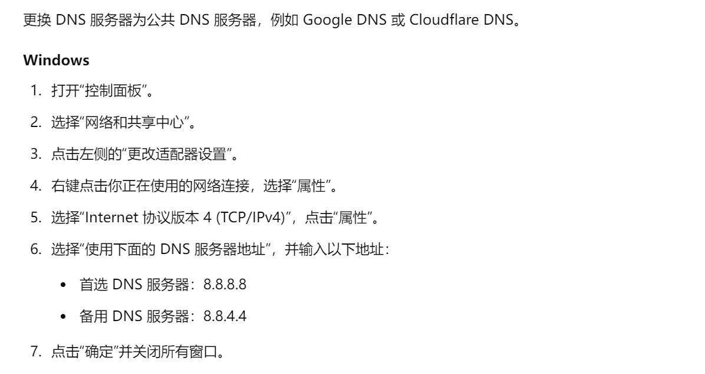
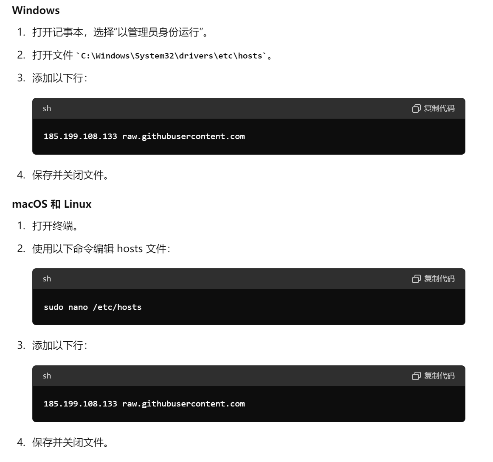
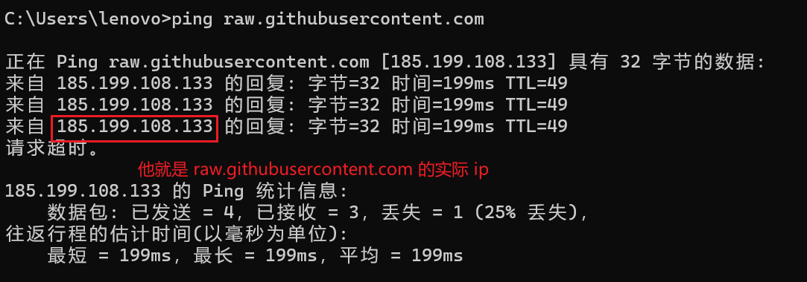
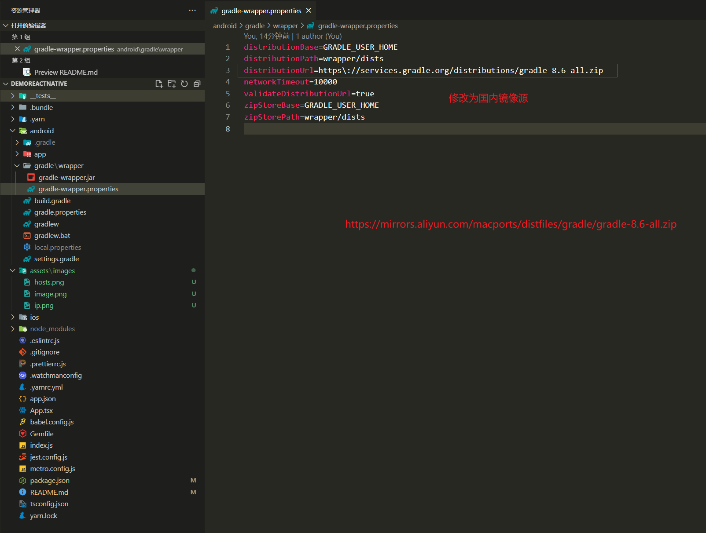

# React Native

[Docs](https://reactnative.cn/)

[En Docs](https://reactnative.dev/) 推荐

## 1、下载

执行 `npx react-native@latest init Demo` 时报：

```
Error: getaddrinfo ENOENT raw.githubusercontent.com
    at GetAddrInfoReqWrap.onlookup [as oncomplete]
```

的解决方法：

1）打开 vpn （推荐）

2）更换 DNS 服务器




3）修改 hosts 文件



注：`185.199.108.133` 是根据 `raw.githubusercontent.com` 获取，获取方式如下：



4）刷新 DNS 缓存

```bash
# Windows

ipconfig /flushdns

# macOS

sudo dscacheutil -flushcache
sudo killall -HUP mDNSResponder

```

进行以上操作就可以下载 React Native。

## 2、运行

1）下载 Gradle 分包过慢



在 `https://mirrors.aliyun.com/macports/distfiles/gradle/` 中找到相应的版本进行下载。

```properties
# gradle-wrapper.properties

distributionBase=GRADLE_USER_HOME
distributionPath=wrapper/dists
distributionUrl=https\://services.gradle.org/distributions/gradle-8.6-all.zip

# 国内镜像源
# distributionUrl=https\://mirrors.aliyun.com/macports/distfiles/gradle/gradle-8.6-all.zip

networkTimeout=10000
validateDistributionUrl=true
zipStoreBase=GRADLE_USER_HOME
zipStorePath=wrapper/dists

```

2）然后在运行

```bash
npm run android
```

